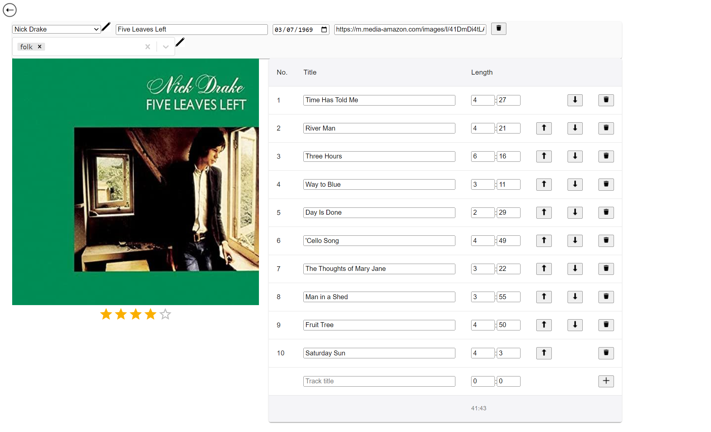
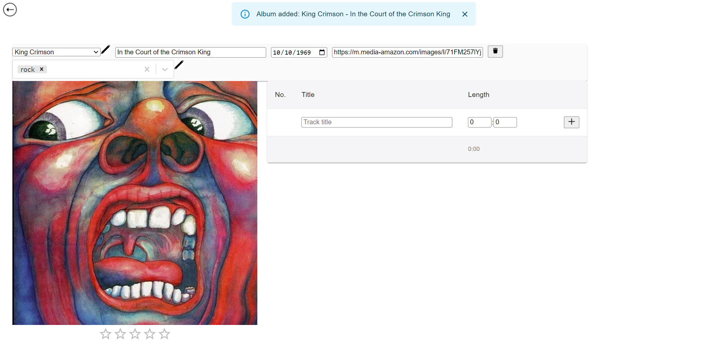

# Album application

An application used to search albums by names, artists and songs. User can insert, remove and update albums and track lists. Data is saved to db.json-file. Built with React, TypeScript, CSS and JSON server. 

# Screenshots

### Album search

### Album info

### Album edit

### Album insert

## Installation and Setup Instructions

Clone down this repository. You will need [node](https://nodejs.org/en) and [JSON server](https://github.com/typicode/json-server) installed on your machine.

Install JSON server:

### `npx json-server --port=3001 --watch db.json`

In the project directory, you can run:

### `npm server start` // start JSON server

### `npm start` // start the application

Open [http://localhost:3000](http://localhost:3000) to view it in the browser.

