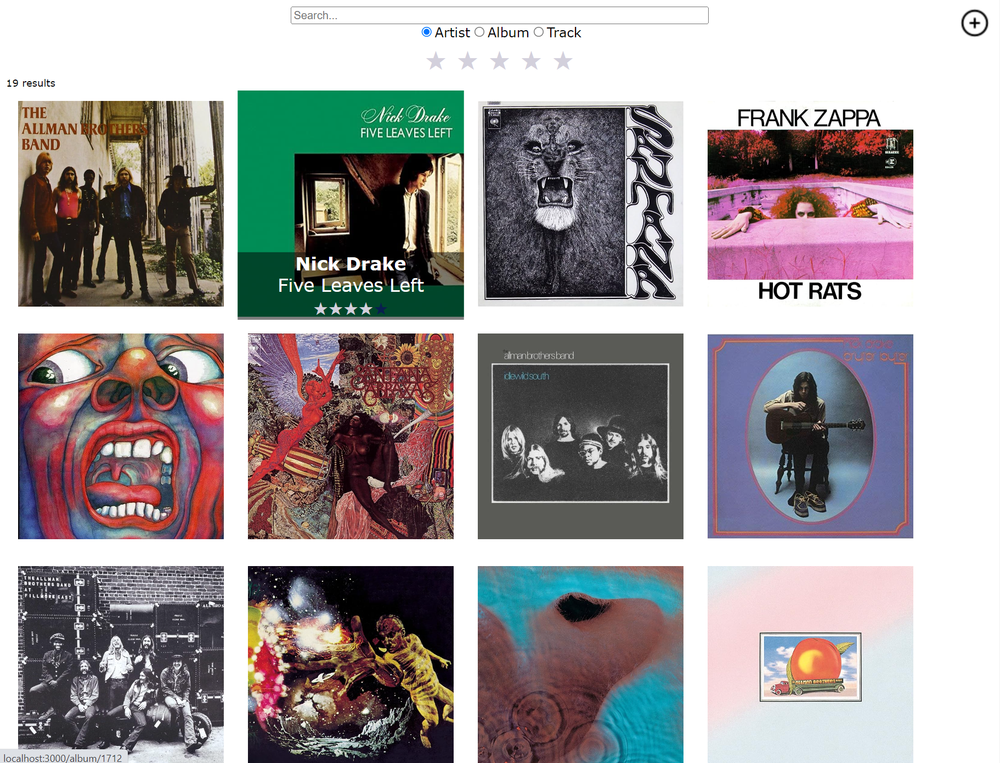

# Album application

An application used to search albums by names, artists and songs. User can insert, remove and update albums and track lists. Frontend is built with React, TypeScript and CSS. Backend with Java, Spring Boot and PostgreSQL. 

# Screenshots

### Album search

### Album info

### Album edit

### Album insert

## Docker
### `docker build . -t album-app` // build image
### `docker run -p 3000:3000 album-app` // run container

Open [http://localhost:3000](http://localhost:3000) to view it in the browser.